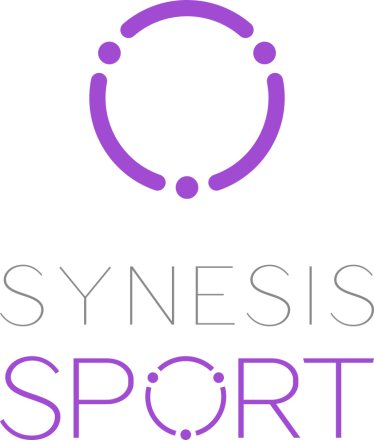

	

	<a href="mailto:jobs@synesis.ru">jobs@synesis.ru</a>

### О нас

**Synesis sport** - подразделение группы компаний [Synesis](http://synesis.by/). 

Мы создаем информационную систему (Event Management System) c инфраструктурой для проведения крупных мероприятий как локального, так и международного уровня. 

Компания **Synesis sport** являемся официальным поставщиком IT-решений для [II Европейских игр 2019](http://minsk2019.by) в Минске.

### Вакансии

### swift iOs 🔝🔥💣🌶📱

>*  мы следим за трендами и где нужно стараемся их использовать: 
>	*  swift 4
>	*  swagger.io
>	*  MVC/ VIPER/ MVVM
>	*  ...
>*  в команде нет зомби: все живые, веселые и опытные ребята! 
>*  делимся опытом и с удовольствием его перенимаем! 
>*  рабочий MacBook каждому сотруднику

▶️ [**подробнее тут**](./positions/iOs-position.md) ◀️

### JS Frontend for ChatEG 💯💬📵🚀🤑 

> Разработка мессенджера для организации бизнес-процессов и коммуникации при проведении крупных мероприятий

▶️ [**подробнее тут**](./positions/javascript-messenger-position.md) ◀️

### JS Frontend for Event Management System 💯🔝💋🕸💣🌶👍

> EMS - это программное обеспечение, необходимое для проведения мероприятий различного уровня (саммиты, экспо, олимпиады, соревнования и прочее)
> 
> Команда занимается 
>	*  создание сервисов (Аккредитация, Размещение, Логистика, Управление персоналом, ...), являющихся частью ядра EMS
>	*  обработка потокового видео
>	*  интеграция с системами фиксации времени, оценок и результов

▶️ [**подробнее тут**](./positions/javascript-position.md) ◀️

### О прочих плюшках(🍦🎂🥐🍰🍧) рады рассказать в переписке или при личной встрече 😉

| ----------------> | <jobs@synesis.ru> | <---------------- |
| ----------------: |:-----------------:| :---------------- |